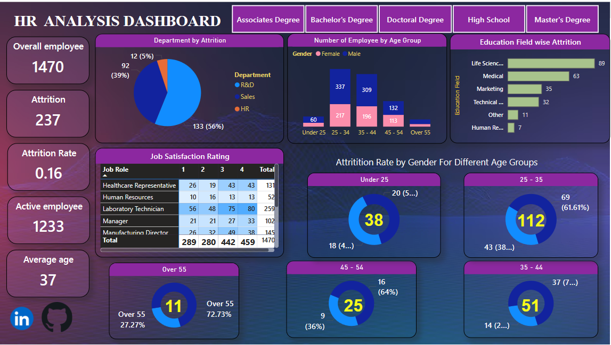

# HR Analytics Dashboard – Power BI

## Project Overview

The HR Analytics Dashboard is an interactive Power BI project designed to analyze employee workforce data and identify key patterns related to employee attrition, demographics, education, job satisfaction, departments, and age groups.

The dashboard provides interactive filtering by education level and enables HR-focused analysis through KPIs and visualizations.

---

## Business Objective

The main objectives of this project are to:

- Analyze employee attrition patterns
- Monitor overall workforce metrics
- Track employee attrition rate
- Analyze active and inactive employees
- Understand workforce distribution across age groups
- Analyze department-wise attrition
- Evaluate job satisfaction across job roles
- Analyze education-field-wise attrition
- Compare attrition patterns across gender and age groups
- Support data-driven HR decision-making

---

## Key KPIs

| KPI | Value |
|---|---:|
| Total Employees | 1,470 |
| Attrition | 237 |
| Active Employees | 1,233 |
| Attrition Rate | 16% |
| Average Age | 37 |

---

## Dashboard Analysis

### 1. Workforce Overview

The dashboard provides a high-level view of the workforce using key HR metrics:

- Overall Employee Count
- Attrition Count
- Active Employee Count
- Attrition Rate
- Average Employee Age

### 2. Department-wise Attrition

Analyzes employee attrition across major departments:

- R&D
- Sales
- HR

This helps identify departments with higher attrition levels.

### 3. Employee Age Group Analysis

Employees are analyzed across different age groups:

- Under 25
- 25–34
- 35–44
- 45–54
- Over 55

The analysis also compares male and female employee distribution across age groups.

### 4. Education Field-wise Attrition

The dashboard analyzes attrition across different education fields, including:

- Life Sciences
- Medical
- Marketing
- Technical
- Human Resources
- Other

### 5. Job Satisfaction Analysis

Job satisfaction is analyzed across different job roles using satisfaction ratings from 1 to 4.

This helps identify workforce satisfaction patterns across roles.

### 6. Gender and Age-group Attrition

Interactive donut charts analyze attrition by gender across different employee age groups.

---

## Tools & Technologies

- Microsoft Power BI
- Power Query
- DAX
- Data Cleaning
- Data Transformation
- Data Validation
- Exploratory Data Analysis (EDA)
- Data Modeling
- Data Visualization
- KPI Analysis

---

## Power BI Features Used

- Interactive slicers
- KPI cards
- Donut charts
- Bar charts
- Stacked column charts
- Matrix tables
- DAX measures
- Interactive filters
- Data modeling
- Dashboard storytelling

---

## Key Insights

The dashboard enables analysis of:

- Overall employee attrition levels
- Department-wise attrition patterns
- Age-group distribution of employees
- Gender-wise attrition patterns
- Education-field-wise attrition
- Job satisfaction across job roles
- Active versus inactive employee population

---

## Dashboard Preview



---

## Interactive Dashboard Views

The dashboard includes interactive education-level filters for:

- Associates Degree
- Bachelor's Degree
- Doctoral Degree
- High School
- Master's Degree

Additional dashboard screenshots are available in the repository.

---

## Repository Contents

```text
HR-Analytics-PowerBI-Dashboard/
│
├── HR ANALYSIS DASHBOARD.pbix
├── HR_Dashboard_Overview.png
├── HR_Dashboard_Associates.png
├── HR_Dashboard_Bachelors.png
├── HR_Dashboard_Doctoral.png
├── HR_Dashboard_HighSchool.png
├── HR_Dashboard_Masters.png
└── README.md

## Project Outcome

This project demonstrates practical experience in:

- Data cleaning and transformation
- Exploratory data analysis
- Data modeling
- DAX-based KPI development
- Interactive dashboard development
- HR analytics
- Business-oriented data visualization
- Data-driven insight generation

---

## Author

**Nikhil Kumar Singh**

Data Analyst | Power BI | SQL | Python | Excel

LinkedIn: [https://www.linkedin.com/in/mrnikhil9/](https://www.linkedin.com/in/mrnikhil9/)

GitHub: https://github.com/MRnikhilkumar
